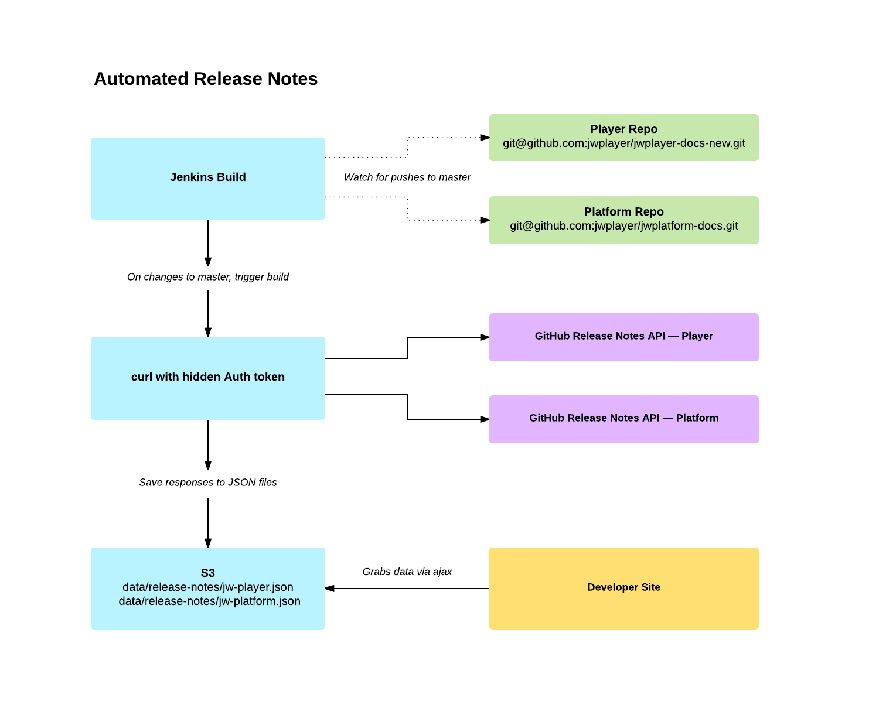

# jwplayer-docs

This is the place where we will keep our support docs.

[Onboarding Docs](https://github.com/jwplayer/jwplayer-docs-new/tree/master/Onboarding%20Documents)

## Developing Locally

#### Install [MkDocs](http://www.mkdocs.org/)

```
$ pip install mkdocs
```

#### Install Node modules:

```
$ npm install
```

#### Install Grunt globally:

```
$ npm install grunt -g cli
```

#### Run Grunt and serve via localhost:

```
$ grunt serve
```

Run `grunt` to for a full build without serving. This may be useful at times because `grunt serve` builds via Grunt's watch task, which may not always be perfect.

## CDN Purge

Use the following URL to purge the CDN for release notes: /data/release-notes/jw-player.json

## Release Notes Build Process


