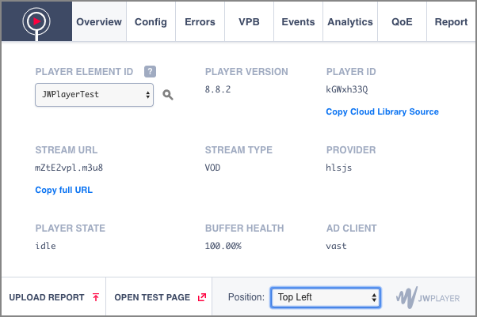
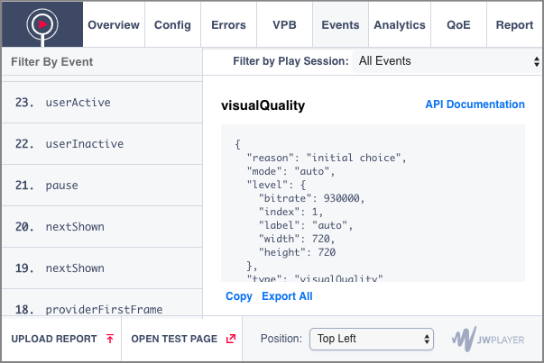
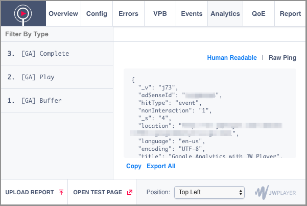

# JW Lens overview

Last Updated: April 15, 2019

After reading our documentation, reviewing our code samples, and examining our demos, you may still be unable to resolve an implementation issue. JW Lens is a browser extension that can help simplify how you troubleshoot your player implementation. 

Once installed, JW Lens captures information emitted by the player and groups similar information together. This helps you to explore and troubleshoot your HTML5 player implementation:

- Troubleshoot player errors
- Validate the player configuration
- Understand the player event lifecycle

 

## Install JW Lens

1. From your Chrome browser, go the the <a href="https://chrome.google.com/webstore/detail/jw-lens/oneljddokkbioaemddedcbdejocnhijg" target="_blank">JW Lens chrome web store page</a>.
2. Click **Add to Chrome**. A pop-up window appears.
3. Click **Add extension**. The extension is added to your browser.

 

## Configure JW Lens

You can select the location where the extension window appears. You can always change the location from any tab of JW Lens.

1. Open JW Lens.
2. From any tab, select a location from the **Position** drop-down menu.

 

## JW Lens tabs

All player information is grouped into seven tabs:

- [Overview](#overview)
- [Config](#config)
- [Errors](#errors)
- [Events](#events)
- [Analytics](#analytics)
- [QoE](#qoe) 
- [Report](#report)

The following sections explain the layout and information that can be obtained from each tab.

 

### Overview

On the **Overview** tab, you can view general information about a JW Player instance and its implementation.

1. Click the **Overview** tab.
2. Select a **PLAYER ELEMENT ID** from the drop-down menu. This focuses JW Lens on this unique player instance.
3. Click the magnifying glass icon next to the drop-down menu. The page scrolls to the location of the player on the page.

 

### Config

On the **Config** tab, configuration used to instantiate the player is displayed. You can copy the configuration to your clipboard or edit the configuration and re-initialize the player with a modified configuration.

#### Copy the player configuration

1. Click the **Config** tab.
2. Click **COPY CONFIGURATION**. The player configuration JSON is copied to your clipboard.

#### Modify the player configuration

!!!
Modifying the player configuration in JW Lens does not change the player configuration used to initiate the player when a viewer visits your page.
!!!

1. Click the **Config** tab.
2. Edit the player configuration.
3. Click **SETUP NEW PLAYER**.

 

### Errors

On the **Errors** tab, a summary of critical media, ads, and player configuration errors is displayed.

1. Click the **Errors** tab.
2. To view detected errors, click the boxed number that appears next an error type. An error screen appears.
3. Review the errors and linked JW Player error documentation. Errors are listed based on JW Player best practices. If you have a unique use case, some of the listed errors may not be applicable. 
4. Click **Return to Troubleshooting** to view the **Errors** tab main screen.

 

### Events

On the **Events** tab, you can view a real-time, filterable feed of the events and accompanying data of the player.

1. Click the **Events** tab.
2. In the **Filter by Play Session** drop-down menu, choose an option to filter the listed events.
3. In the **Filter By Event** list, click an event. The details of the event appear.

After clicking an event, you can perform several tasks:

- Click **API Documentation** to read about a specific event.
- Click **Copy** to copy the event JSON to your clipboard.
- Click **Export All** to download a .json file of all player events.

 

### Analytics

On the **Analytics** tab, you can view a real-time, filterable feed of Google Analytics pings.

1. Click the **Analytics** tab.
2. In the **Filter By Type** list, click a Google Analytics item. The details of the item appear.

After clicking an item, you can perform several tasks:

- Click **Human Readable** or **Raw Ping** to toggle between views of the specific item.
- Click **Copy** to copy the event JSON to your clipboard.
- Click **Export All** to download a .json file of all player events.

 

### QoE

On the **QoE** (Quality of Experience) tab, you can view the performance of both the player instance and the page in which the player instance is embedded. This tab is populated after the player fires the initial `on('firstFrame')` event. 

You can also click **VIEW GOOGLE PAGE SPEED ANALYSIS** to view additional page speed information.

The following tables list and define the measurements that are displayed on this tab.

#### Player QoE

| Measurement | Description |
| -- | -- |
| Total Setup Time | Time required to instantiate the player, as defined in the [on(‘ready’)](https://developer.jwplayer.com/jw-player/docs/javascript-api-reference/#jwplayeronready) event|
| Player Resource Fetch Range | Time range in which JW Player resources are requested  This range begins with the request of jwplayer.js and ends with the last module required for setting up the player.   <strong>NOTE</strong>: In some cases, this measure will not be available. In particular, if the player scripts are bundled or renamed, this range will not be detected.|
|Page Request to Ready | Time (starting from 0) after which the JW Player [ready](https://developer.jwplayer.com/jw-player/docs/javascript-api-reference/#jwplayeronready) event is fired|
|Time to First Frame | Time between the `playAttempt` to [firstFrame](https://developer.jwplayer.com/jw-player/docs/javascript-api-reference/#jwplayeronfirstframe) events |
|Ad Loading (Ad Request to Ad Impression) | Time between the [adRequest](https://developer.jwplayer.com/jw-player/docs/javascript-api-reference/#jwplayeronadrequest) and [adImpression](https://developer.jwplayer.com/jw-player/docs/javascript-api-reference/#jwplayeronadimpression) events. |

#### Page QoE

| Measurement | Description |
| -- | -- |
|DOM Content Loaded | Time between `navigationStart` and `domContentLoadedEventEnd` window events |
|DOM Load | Time between `navigationStart` and `loadEventEnd` window events |
|Time to Interactive | Time between `navigationStart` and `domInteractive` window events |
|Total Resources Loaded | Total number of resources requested by the time the [on('firstFrame')](https://developer.jwplayer.com/jw-player/docs/javascript-api-reference/#jwplayeronfirstframe) event fires|

 

### Report

Use the **Report** tab to create a .json file to include with your submission when you submit a support ticket for the JW Player Support team to troubleshoot your player issues.

1. Click the **Report** tab.
2. If an issue occurs in more than one browser, add the additional browsers in the **What browsers does this issue appear in?** text box.   **NOTE**: JW Lens automatically populates the Chrome browser information of the open active tab.
3. In the **Please enter a short description of the issue and/or reproduction steps** text box, provide a description of the issue that is occurring.
4. Click **DOWNLOAD**.
5. Upload the .json file to an online location like Dropbox, Google Drive, or your own server.
6. [Submit a support case](https://support.jwplayer.com/submit-support-case).
7. In the Reproduction page field, add the URL of the .json file.

## Upload Report and Open Test Page

The **Upload Report** and **Open Test Page** features allow to review the player on a page that does not have external CSS or JavaScript. This can help you determine if a player issue is caused because of a player configuration or a conflict with an element on your page.

### Upload Report

You can upload a .json file generated from the Report tab. The .json file is used to load a player in a new browser tab. This can be useful if your JW Player Support team member sends you a revised .json file to review or test.

1. From any tab, click **UPLOAD REPORT**.
2. Select the .json file from your computer. A new browser tab opens with the player and relevant information displayed.
3. (Optional) Click **Test Latest Production Channel Player** to see if an issue persists in another player version.

### Open Test Page

You can view the player you are troubleshooting on a new browser tab.

1. From any tab, click **OPEN TEST PAGE**.
2. (Optional) Click **Test Latest Production Channel Player** to see how the player renders in another player version.

